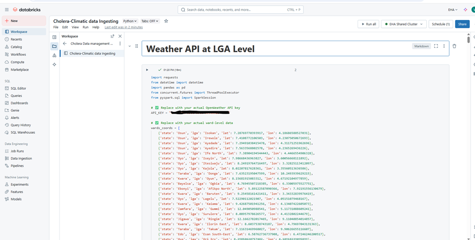
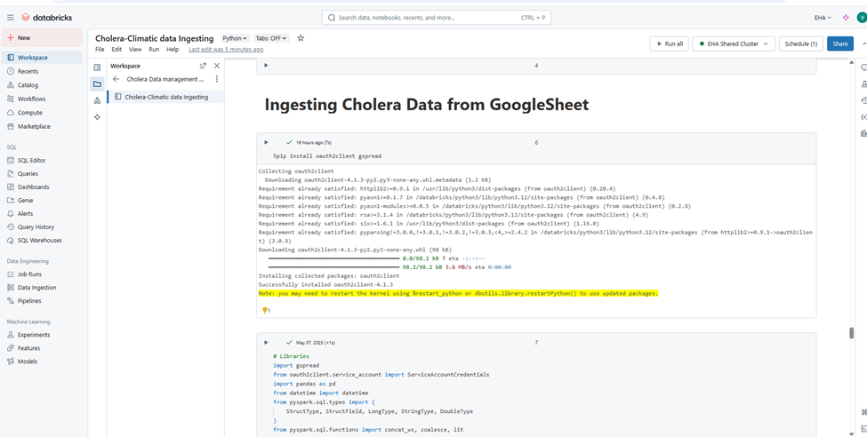
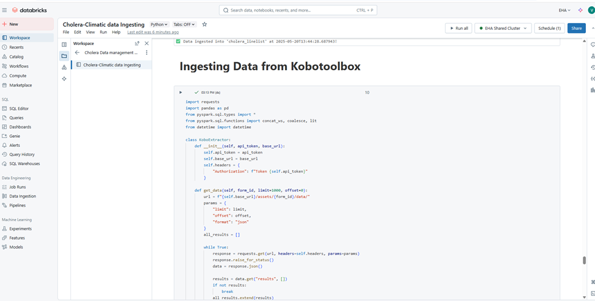

# SOP: Data Management - Data Modeling and Schema Design for Cholera Analytics


### **Objective**

To establish a consistent and scalable process for designing data schemas, ingesting, integrating, and managing cholera and weather data within a data warehouse environment to support reliable analytics and reporting.

### **Scope**

This covers the schema design and data modeling of cholera outbreak data and associated weather data ingested at the LGA level, including data ingestion, integration, and transformation steps implemented in Databricks.

### **Responsibility**

- Data Engineer / Data Scientist: Responsible for schema design, data ingestion, integration, and pipeline development.  

- Data Analyst / Dashboard Developer: Responsible for utilizing the integrated data for analytics and reporting.  

- Data Governance Team: Ensures compliance with data quality, privacy, and security standards.  

### **Prerequisites**

- Access to Databricks workspace and clusters  

- Credentials for OpenWeather API, Google Sheets, and KoboToolbox  

- Defined schema for weather and cholera datasets  

- Data ingestion and ETL jobs configured on Databricks  

### **Procedure**

#### **1\. Schema Design**

1.1 **Weather Data Schema** (Ingested from OpenWeather API at LGA level):

| **Field Name**       | **Data Type** | **Description**                  |
|----------------------|--------------|----------------------------------|
| state                | string       | Nigerian State                   |
| lga                  | string       | Local Government Area            |
| lat                  | double       | Latitude                         |
| lon                  | double       | Longitude                        |
| error                | string       | Error message if any             |
| timestamp            | string       | Data retrieval timestamp         |
| weather              | string       | Weather description              |
| temperature          | double       | Temperature (°C)                 |
| feels_like           | double       | Feels like temperature (°C)      |
| humidity             | double       | Relative Humidity (%)            |
| pressure             | double       | Atmospheric pressure (hPa)       |
| visibility           | double       | Visibility (meters)              |
| wind_speed           | double       | Wind speed (m/s)                 |
| wind_direction       | double       | Wind direction (degrees)         |
| cloudiness           | double       | Cloud cover (%)                  |
| precipitation        | double       | Rainfall (mm)                    |
| air_quality_index    | double       | AQI                               |
| pm2_5                | double       | Particulate matter 2.5 µm        |
| pm10                 | double       | Particulate matter 10 µm         |
| co                   | double       | Carbon monoxide (ppm)            |
| no2                  | double       | Nitrogen dioxide (ppm)           |
| so2                  | double       | Sulfur dioxide (ppm)             |
| o3                   | double       | Ozone (ppm)                      |


<br>

1.2 **Cholera Data Schema** (Ingested from Google Sheets and KoboToolbox):

| **Field Name** | **Data Type** | **Description** |
|---------------|--------------|-----------------|
| sn | long | Serial number |
| epid_no | string | Epidemiological number |
| state | string | Nigerian State |
| lga | string | Local Government Area |
| ward | string | Ward name |
| settlement | string | Settlement name |
| location_id | string | Unique location identifier |
| first_name | string | Patient first name |
| surname | string | Patient surname |
| age_years | double | Patient age in years |
| age_months | double | Patient age in months |
| gender | string | Gender (M/F) |
| date_of_onset | date | Date of symptom onset |
| epi_week | double | Epidemiological week |
| date_seen_at_hf | date | Date seen at health facility |
| reporting_health_facility | string | Name of reporting health facility |
| inpatient_outpatient | double | 1: Inpatient, 0: Outpatient |
| received_ocv | string | Received oral cholera vaccine (Y/N) |
| no_of_ocv_recieved | double | Number of OCV doses received |
| date_received_last_ocv | date | Date last OCV received |
| date_of_admission | date | Date of hospital admission |
| level_of_dehydration | string | Dehydration level |
| specimen_take | string | Specimen taken (Y/N) |
| date_of_sample_collection | date | Date of sample collection |
| rdt_result | string | Rapid diagnostic test result |
| culture_result | string | Culture test result |
| serotype | string | Cholera serotype |
| outcome | string | Patient outcome (Recovered/Death) |
| date_of_death | date | Date of death if applicable |
| date_of_discharge | date | Date of discharge |
| remark | string | Additional remarks |


#### **2\. Data Ingestion**

2.1 **Weather Data Ingestion**

- Use the OpenWeather API to fetch daily weather and air quality data at the LGA level.  

- Validate schema conformity and cleanse data (handle missing or erroneous values).  

- Store ingested data in a raw or bronze table in Databricks.



2.2 **Cholera Data Ingestion**

- Set up connectors to Google Sheets and KoboToolbox for real-time or scheduled extraction.
- Validate data for schema consistency and completeness.  

- Store cholera data in a raw or bronze table in Databricks.

    
    

2.3 **Automation**

- Create and schedule Databricks Jobs to run daily ingestion pipelines for both data sources.

    

#### **3\. Data Integration and Modeling**

3.1 **Data Cleaning and Transformation**

- Normalize key fields (state, lga) to ensure consistent casing and spelling.  

- Convert date fields into proper date or timestamp formats.  

- Handle nulls, duplicates, and anomalies.  

3.2 **Joining Data**

- Perform inner or left joins between weather and cholera datasets on state and lga. Databricks pipeline was created to handle the joining of both Tables

```python
import dlt # Correct import for Delta Live Tables
from pyspark.sql.functions import col
from pyspark.sql import DataFrame

# Flatten and prefix columns (recursive for nested fields)
def flatten_with_prefix(df: DataFrame, prefix: str) -> DataFrame:

    def _flatten(schema, parent=""):

        fields = []

        for field in schema.fields:
        name = field.name
        dtype = field.dataType
        qualified_name = f"{parent}.{name}" if parent else name
        alias_name = f"{prefix}_{qualified_name.replace('.', '_')}"

        if "StructType" in dtype.simpleString():
        fields += _flatten(dtype, qualified_name)
        else:
        fields.append((qualified_name, alias_name))

        return fields

    flattened_fields = _flatten(df.schema)

    return df.select([col(field).alias(alias) for field, alias in flattened_fields])

@dlt.table

def cholera_climatic_prefixed():

    # Read from DLT input tables
    cholera_df = dlt.read("cholera_linelist")

    weather_df = dlt.read("eha.default.weather_data_by_lga")

    # Flatten and prefix
    cholera_prefixed = flatten_with_prefix(cholera_df, "cholera")

    weather_prefixed = flatten_with_prefix(weather_df, "weather")

    # Join tables (make sure matching columns exist)
    joined_df = (
    cholera_prefixed
    .join(
    weather_prefixed,
    (cholera_prefixed["cholera_state"] == weather_prefixed["weather_state"]) &
    (cholera_prefixed["cholera_lga"] == weather_prefixed["weather_lga"]),
    "left"
    )
    )

    return joined_df
```


- Consider adding temporal join criteria based on timestamp and date_of_onset for time-series correlation.  

3.3 **Schema Design for the Data Warehouse**

- Design a star schema or a wide fact table combining both weather and cholera data keyed on state, lga, and date.  

- Example fact table fields:  
  - state, lga, date  

  - Weather attributes (temperature, humidity, precipitation, etc.)  

  - Cholera case counts, outcomes, vaccine coverage, etc.  

#### **4\. Data Storage and Management**

- Store integrated datasets in a Silver or Gold Delta table for analytics.  

- Partition tables by state and date to optimize query performance.  

- Maintain audit logs for ingestion jobs and schema changes.  

#### **5\. Analytics and Reporting**

- Connect the integrated dataset to BI tools (Databricks SQL Analytics, Power BI, Tableau, or custom dashboards).  

- Build dashboards showing cholera trends, vaccine coverage, and correlated weather patterns.  

- Enable drill-down by state, lga, and time windows.  

### **Documentation & Version Control**

- Maintain schema documentation and data dictionaries in a central repository (e.g., Confluence, GitHub README).  

- Version control Databricks notebooks and SQL scripts in Git.  

- Log all schema updates and ETL changes in release notes.  

### **Quality Assurance**

- Periodically validate data accuracy by cross-referencing source data.  

- Monitor ingestion job logs and set up alerts for failures or anomalies.  

- Conduct peer reviews for schema changes and pipeline updates.  

### **Review Cycle**

- Review and update the SOP quarterly or after major schema or pipeline changes.