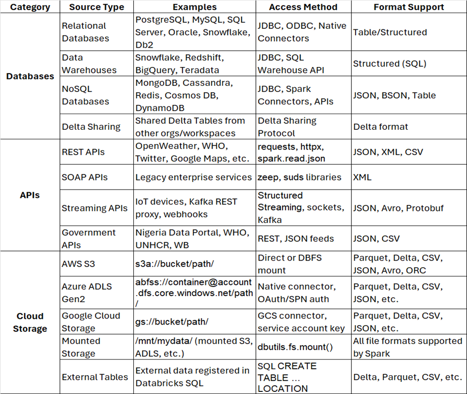
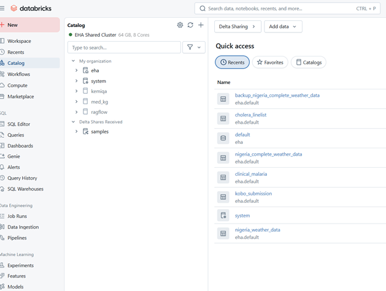
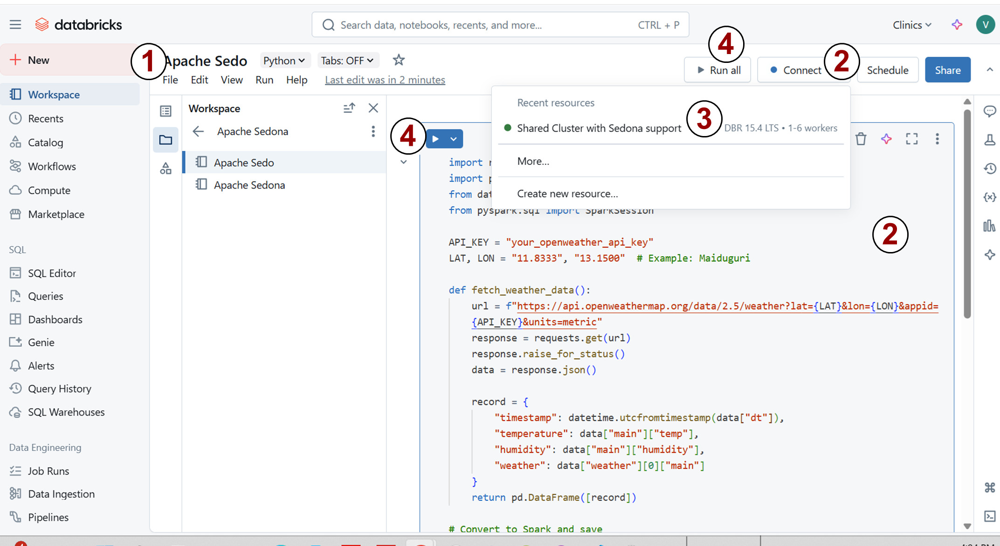
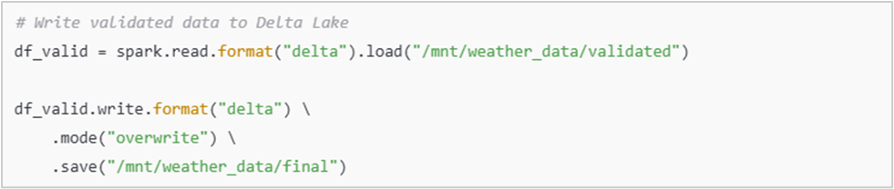
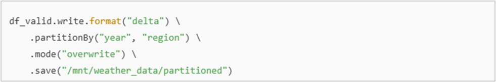
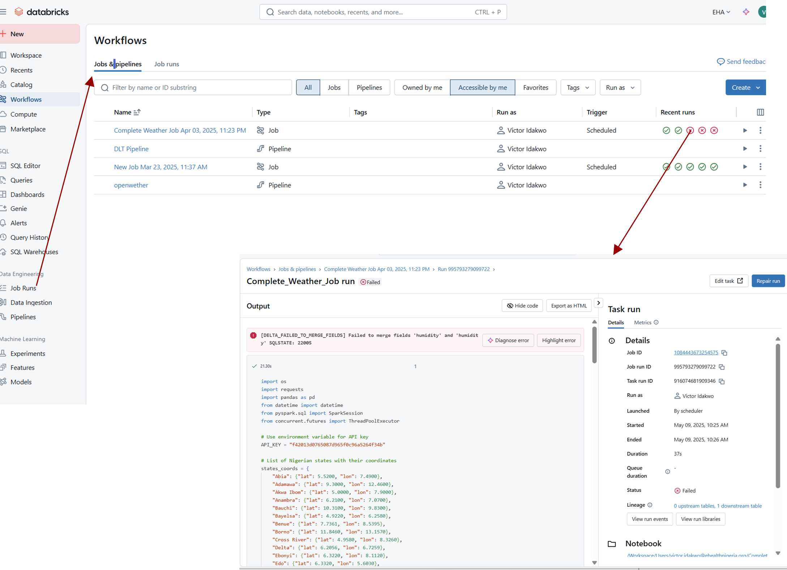
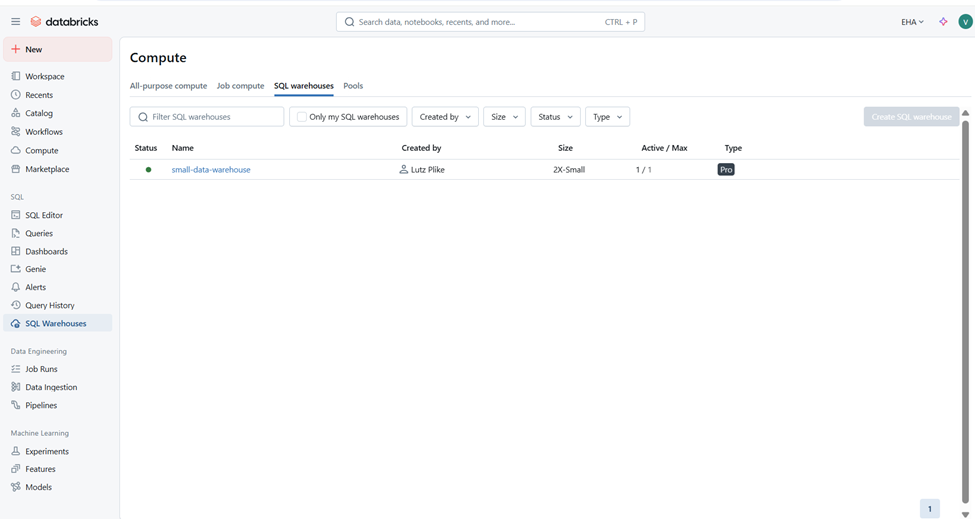
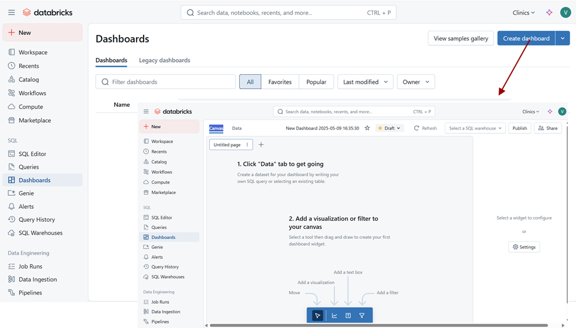

# **Standard Operating Procedure (SOP) for Data Synchronization on Databricks**


# **Objective:**

To establish a standardized approach for data synchronization in Databricks environments, ensuring consistent, accurate, and timely data processing across different systems, databases, and applications.

# **Scope:**

This SOP applies to all data synchronization activities within the Databricks environment, including the integration of data from external sources, databases, and applications into Databricks, and vice versa.

# **Responsibilities:**

- Data Engineers: Responsible for implementing and maintaining data synchronization pipelines.  

- Data Analysts/Scientists: Ensure that the synchronized data meets analysis and model training requirements.  

- System Administrators: Ensure the security, performance, and stability of the Databricks environment.  

- Project Managers: Oversee and ensure timely completion of data synchronization tasks.  

# **Prerequisites:**

- Databricks Workspace Setup: A properly configured Databricks workspace.  

- Source and Target Systems: Define and configure data sources (e.g., cloud storage, databases, APIs) and target destinations (e.g., Delta Lake, Azure Data Lake, AWS S3).  

- Access Permissions: Ensure proper access control policies are in place for users and systems interacting with Databricks in the case access permission is granted to Project Manager using organizational email to access work space.  

- Cluster Configuration: Ensure access to a shared Databricks cluster (appropriately sized and configured for the data synchronization tasks) or you can create a personal cluster (although limited) for small tasks.  

# **Data Synchronization Process:**

#### 1\. Identifying Data Sources and Targets

- Data Sources: Identify the data sources (e.g., databases, APIs, cloud storage) from which the data will be extracted.

      

2. Data Targets: For data Synchronization or migration, there must be a target in this case Databricks where data will be stored after synchronization including:

- **Delta Lake (Recommended for Most Use Cases):**

    This optimized storage layer that adds ACID transactions, versioning, and schema enforcement to data stored in data lakes. Tables stored can be retrieved through the catalog

    
    ```python
    # How to write data from data sources into Delta lake
    df.write.format("delta").mode("overwrite").save("/mnt/mydata/delta/my_table")

    # How to Read Delta lake table spark.read.forma
    ("delta").load("/mnt/mydata/delta/my_table")
   ```
    **DBFS (Databricks File System)**

    DBFS is an abstraction layer on top of cloud object storage, Lets you interact with storage using Unix-like paths (/dbfs/...) or mount points (/mnt/...). Files like shapefiles, CSV, Excel, Json etc can be uploaded using the DBFS UI on Databricks.

    
    ```python
    # How to Save a DataFrame as CSV
    df.write.csv("/dbfs/tmp/mydata.csv")

    # How to Read back the saved file
    df2 = spark.read.csv("/dbfs/tmp/mydata.csv")
    ```

**External data Storage**

This refers to using **cloud storage (S3, ADLS, GCS)** rather than relying solely on DBFS's default workspace storage of databricks. Common external storage include:


| Cloud | Storage        | Example of URL                                                |
|------|----------------|----------------------------------------------------------------|
| AWS  | S3             | s3a://my-bucket/data/                                          |
| Azure| ADLS Gen2      | abfss://container@account.dfs.core.windows.net/folder/         |
| GCP  | GCS            | gs://my-bucket/data/                                           |

#### **2\. Data Extraction**

As a data Analyst/Engineer Efficient and resilient data extraction is essential to ensure reliable ingestion from various sources into Databricks. This phase includes scheduling, change detection (incremental loads), error resilience, and monitoring.

- **Scheduled Extracts:** first you need to create a Notebook on Databricks, ``import`` required libraries or install required libraries eg ``pip install geopandas``, get necessary access credentials and write to an already created ``Delta Table``. Then connect with a compute or create a personal compute.

    Go to workspace → Click create → click Notebook

    

    In the New Notebook → Rename your Notebook → Type in your code → click connect → select Compute/cluster you want to use and start running code sell one after the other or run all

    

    Then Set up extraction jobs to run the Databricks Notebooks to pull data from source systems.

    Databricks Job
    

2.  Incremental Data Extraction: Implement incremental extraction by comparing timestamps or other unique identifiers to ensure only new or updated records are pulled.

    
    ``To be Triggered by Jobs``

    - Error Handling: Define error handling mechanisms for failed extraction jobs, such as logging errors and retrying the operation after a set interval.  

#### 3\. Data Transformation

1. Data Preprocessing: Use Databricks notebooks to perform necessary transformations, such as data cleaning, normalization, or enrichment.  

    

2. Data Validation: Validate data during transformation to ensure completeness, accuracy, and consistency before loading it into the target system.

    

3. Delta Lake Optimizations: If using Delta Lake, use the ``MERGE``operation to ensure that updates and deletes are accurately reflected in the target.

    

#### 4\. Data Loading

Date Loading comes after the data is transformed and validated. Data is loaded efficiently into the target storage layer, ensuring it is organized and query-ready for downstream analytics or ML workflows.

1. Load Data into Target: Using Databricks jobs or notebooks the transformed data can be loaded into the target system such as delta tabe

    

2. Partitioning Data: For large datasets, partition data by relevant columns (e.g., date, region) to optimize query performance.  

      

#### 5\. Data Monitoring and Logging

1. Job Monitoring: Use Databricks job dashboards to monitor the execution of data synchronization jobs.

    

2. Error Logs: Set up centralized logging for all data synchronization jobs using Databricks' built-in logging capabilities (e.g., CloudWatch, Azure Monitor).

    

3. Alerting: Alert can be configured as email for job failures or performance issues to quickly address any problems with synchronization.  

    

# Security and Compliance  

- Access Controls: Use Databricks' role-based access control (RBAC) to define and enforce appropriate permissions for users accessing source and target systems.  

- Data Privacy: Ensure compliance with data privacy regulations (e.g., GDPR, HIPAA) by implementing necessary safeguards, such as data anonymization and access logging.  

# **Troubleshooting and Error Management:**

- Job Failures: Investigate job failure logs to identify the root cause (e.g., data quality issues, network problems, permission errors).  

- Data Quality Issues: Resolve data quality issues before they propagate into downstream systems by validating data during synchronization.  

- Retry Mechanisms: Implement automatic retries for transient errors (e.g., network failures) to ensure minimal disruption.  
    <br/>

# **Creating Dashboard in Databricks**

### Prepare Your Data

→ Choose or create a **SQL Warehouse**


→ Go to Dashboards tab


→ Add Queries to Dashboard


→ Share or Schedule


# **Conclusion:**

This SOP ensures the efficient, secure, and reliable synchronization of data in Databricks environments. By adhering to these processes, organizations can maintain consistency across their data systems and improve the reliability of analytics and model training tasks.

#

# **References:**

- Databricks Documentation: <https://docs.databricks.com/>
- Delta Lake Documentation: <https://docs.delta.io/latest/>
- Databricks Jobs API: <https://docs.databricks.com/dev-tools/api/latest/jobs.html>