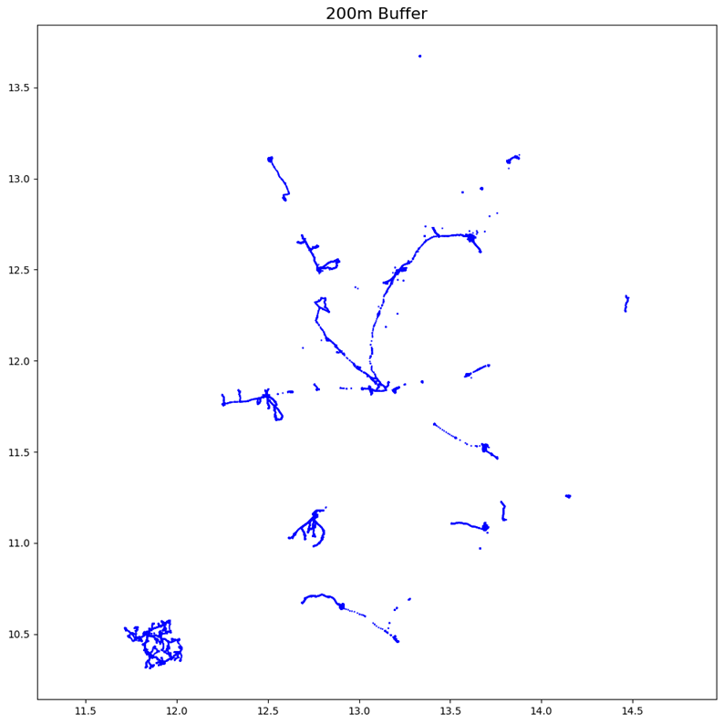
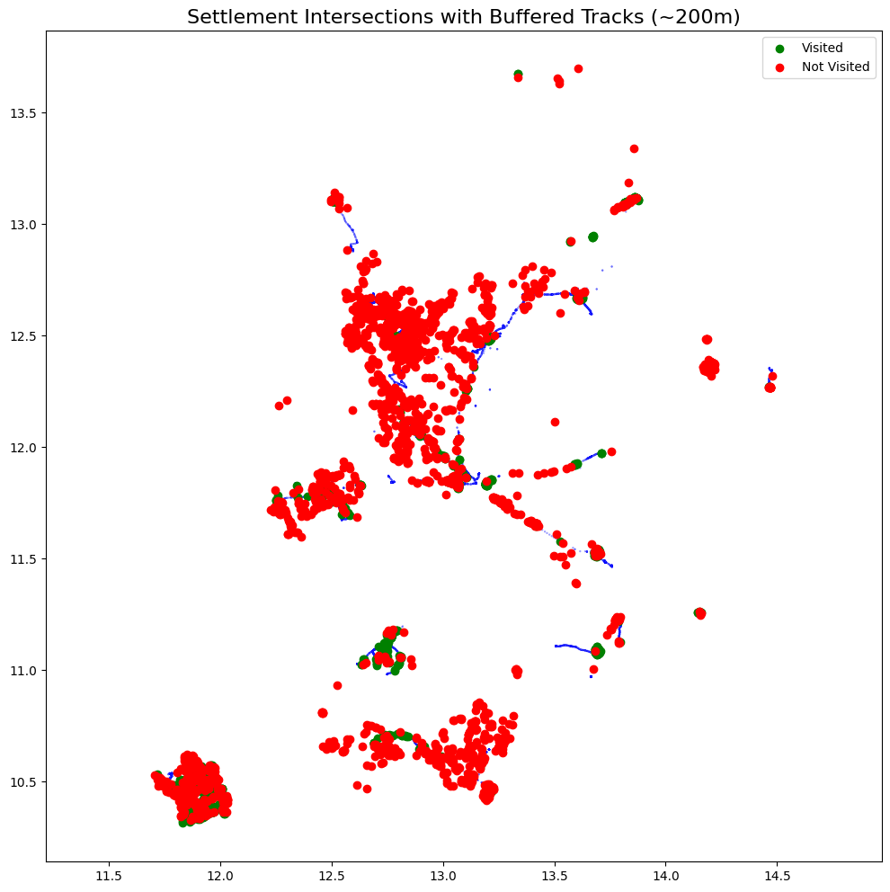
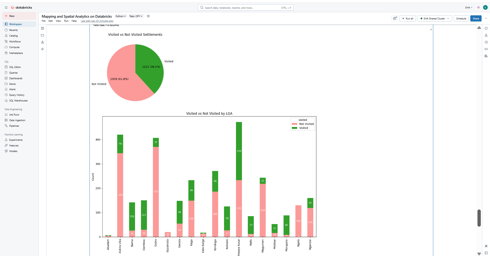

# **SOP: Creating Maps and Performing Spatial Data Analysis in Databricks**


## **1\. Overview**

This SOP details the process to:

- Load spatial data (e.g., shapefiles) from Databricks File System (DBFS) or Unity Catalog volumes.  

- Visualize spatial data by creating maps with legends, scale bars, and annotations.  

- Perform spatial operations such as buffering and spatial intersections.  

- Generate summary visualizations and reports based on spatial analysis.  

The workflow uses Python libraries including ``geopandas``, ``matplotlib``, and ``matplotlib_scalebar``.

## **2\. Environment Setup**

### **2.1 Install Required Libraries**

Ensure the following libraries are installed in your Databricks cluster or environment:

```python
pip install geopandas matplotlib matplotlib_scalebar
```

If libraries are already installed, verify their versions are compatible.

### **2.2 Restart Kernel**

After installing packages, restart the Python kernel to apply updates:
```python
restart_python
or
dbutils.library.restartPython()
```

## **3\. Data Preparation**

**3.1 Ingesting Shapefile into DBFS**


**3.2 Ingesting Shapefile in Unity catalog Volume**


### **3.3 Copy Shapefiles from DBFS to Local Workspace**

Copy all shapefile components (shp, shx, dbf, prj, etc.) recursively from DBFS to the local filesystem for easy access:

```python
dbutils.fs.cp("dbfs:/FileStore/tables/Shapefiles","file:/Workspace/Users/your.email@domain.org/Shapefiles", recurse=True)

```

## **4\. Loading Spatial Data**

### **4.1 Import Libraries**

```python
import geopandas as gpd
import matplotlib.pyplot as plt
from matplotlib_scalebar.scalebar import ScaleBar
import matplotlib.patches as mpatches
```

### **4.2 Load Shapefiles**

Load shapefiles into GeoDataFrames (```gpd.read_file()```):

```python
shapefile_path = "/Workspace/Users/your.email@domain.org/Shapefiles/boundary_state_default.shp"
gdf = gpd.read_file(shapefile_path)

```

## **5\. Creating Maps**

### **5.1 Basic Plot with Legend**

```python
fig, ax = plt.subplots(figsize=(12, 12))
gdf.plot(column='state_name', ax=ax, cmap='tab20', edgecolor='black', legend=True)
```
Replace ``'state_name'`` with the actual attribute column you want to use for coloring.

### **5.2 Add Scale Bar**

```python
scalebar = ScaleBar(1, location='lower right') # 1 unit = 1 map unit (e.g., meters)
ax.add_artist(scalebar)
```
### **5.3 Add Legend with Custom Handles**

Create custom legend handles if needed for clarity.


## **6\. Spatial Data Analysis**

### **6.1 Load Tracks and Settlements**

```python
tracks_path = "/Volumes/eha/default/neoc_data/Day 4 tracks.shp"

gdf_tracks = gpd.read_file(tracks_path)

settlements_path = "/Volumes/eha/default/neoc_data/April OBR Planned Settlements.shp"

gdf_settlements = gpd.read_file(settlements_path)
```


### **6.2 Buffer Operation on Tracks**

- Convert buffer distance (e.g., 200 meters) into degrees if CRS is geographic (Warning: use projected CRS for accurate buffering):  

```python
buffer_meters = 200

buffer_degrees = buffer_meters / 111000 # Approximate conversion for WGS84 lat/lon

gdf_tracks_buffered = gdf_tracks.copy()

gdf_tracks_buffered['geometry'] = gdf_tracks.geometry.buffer(buffer_degrees)
```


_Note:_ For accurate buffering, project data to an appropriate projected CRS before buffering:

```python
gdf_tracks = gdf_tracks.to_crs(epsg=32633) # Example UTM zone CRS

gdf_tracks_buffered = gdf_tracks.copy()

gdf_tracks_buffered['geometry'] = gdf_tracks.geometry.buffer(buffer_meters)

gdf_tracks_buffered = gdf_tracks_buffered.to_crs(epsg=4326) # Back to WGS84
```

### **6.3 Spatial Intersection**

Determine which planned settlements fall within buffered tracks:

```python
gdf_settlements['visited'] = gdf_settlements.geometry.intersects(gdf_tracks_buffered.unary_union)
```


### **6.4 View and Summarize Results**

Display a table showing visitation status:

```python
display(gdf_settlements[['geometry', 'visited'] + col for col in gdf_settlements.columns if col not in ['geometry', 'visited']]])
```
Plot visitation counts by ward or other attribute:

```python
visited_by_ward = gdf_settlements.groupby(['ward_name', 'visited']).size().unstack(fill_value=0)

visited_by_ward.plot(kind='bar', stacked=True, figsize=(12, 8), color=['#fb9a99', '#33a02c'])

plt.title("Visited vs Not Visited by Ward")

plt.xlabel("Ward Name")

plt.ylabel("Count")

plt.show()

```



## **7\. References**

- [GeoPandas Documentation](https://geopandas.org/)
- [Matplotlib Documentation](https://matplotlib.org/stable/index.html)
- [Matplotlib Scalebar](https://github.com/ppinard/matplotlib-scalebar)