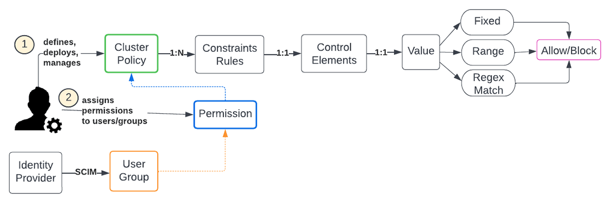
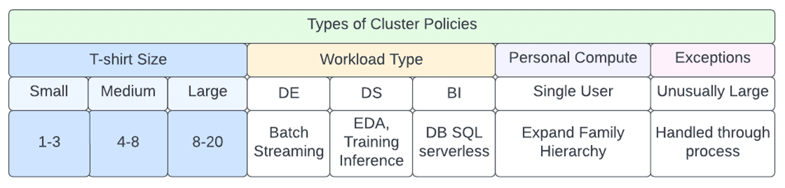
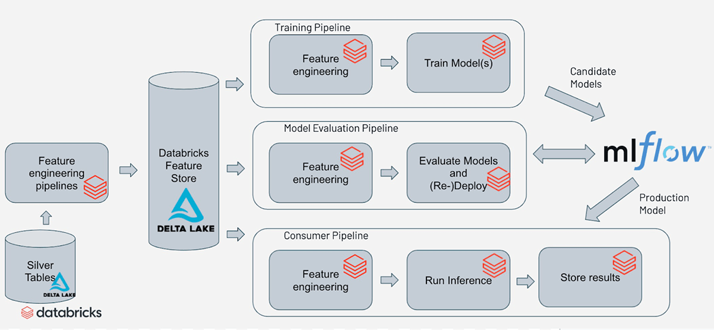
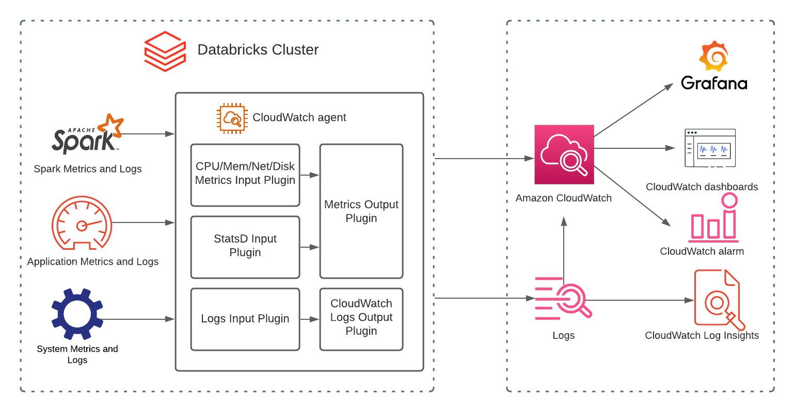

# **End to End Standard Operating Procedure (SOP) on Databricks in eHealth Africa**


# Purpose / Objective

The purpose of this SOP is to standardize the use of Databricks across eHealth Africa for data ingestion, transformation, analysis, machine learning, observability, and governance.  
By following this SOP, teams will ensure:

- Efficiency - standardized workflows reduce duplication and manual rework.
- Reproducibility - consistent environments and CI/CD guarantee repeatable results.
- Security - strict access control, encryption, and audit compliance.
- Cost Optimization - controlled usage and FinOps oversight prevent overspending.
- Scalability - supporting growing datasets and workloads without sacrificing governance.

# Scope

This SOP defines the operational boundaries and responsibilities for all activities performed within the Databricks environment. The scope is intentionally broad to encompass the full lifecycle of data and machine learning workflows, ensuring that processes remain consistent, reproducible, and governed.

1. **Data Integration:** The SOP recognizes that modern data workflows rely on diverse data sources, including APIs, relational and NoSQL databases, flat files, and real-time streaming systems. Standardizing integration practices ensures data quality, security, and traceability across all ingestion pipelines.
2. **Data Processing and Transformation Pipelines:** Reliable and well-documented transformation pipelines are critical for preparing raw data for analytics and machine learning tasks. By including these pipelines in the scope, the SOP emphasizes governance, reproducibility, and operational efficiency while supporting version control and collaborative development.
3. **Machine Learning Lifecycle:** Machine learning experimentation, training, deployment, and monitoring are included to ensure that models are developed and maintained according to best practices. Integration with MLflow and Unity Catalog guarantees proper tracking, versioning, and governance, mitigating risks associated with untested or unauthorized models being deployed.
4. **Centralized Data Governance:** The inclusion of Unity Catalog ensures consistent management of data access, permissions, and lineage. This central governance prevents unauthorized access, enables compliance with organizational policies, and improves auditability.
5. **Monitoring, Observability, and Cost Optimization (FinOps):** Continuous monitoring of workloads, pipelines, and clusters ensures that anomalies, failures, or inefficiencies are detected early. Including FinOps principles emphasizes cost-awareness and resource optimization, ensuring that Databricks usage remains both efficient and economically sustainable.
6. **Automation with SmolAgents:** Automated enforcement and remediation via SmolAgents reduce human error, improve operational speed, and ensure adherence to the SOP. This covers tasks such as policy enforcement, issue resolution, and system notifications, providing a proactive approach to operational excellence.

# Responsibilities
| **Role** | **Responsibilities** |
|---------|----------------------|
| **Data Engineers** | Design, build, and maintain ingestion/transformation pipelines using Delta Lake and ACID guarantees. |
| **Data Analysts / Scientists** | Use curated datasets for analysis and ML while adhering to catalog governance and security rules. |
| **System Administrators** | Oversee Databricks infrastructure, enforce cluster policies, monitor performance, and handle escalations. |
| **Project Managers** | Ensure delivery timelines, SOP adherence, and coordinate stakeholders. |
| **Virtual DevOps Agents (SmolAgents)** | Continuously monitor, enforce compliance, detect anomalies, and apply safe remediations. |
#

# Prerequisites

Before execution of tasks, certain foundational elements must be established to ensure smooth, secure, and compliant use of Databricks. These prerequisites serve as the baseline upon which all subsequent processes will operate.

## 1\. Workspace Setup

A proper workspace structure must be defined prior to any implementation. Development, QA, and Production (Dev/QA/Prod)environments should be clearly separated to avoid cross-contamination of code and data. This separation ensures that experimental or unstable work in the development environment does not impact production systems. Unity Catalog should be integrated across all environments to provide a consistent governance layer, enabling centralized management of data assets, permissions, and lineage.

## 2\. Source/Target Systems

All data sources and destinations must be formally approved and documented before being connected to Databricks. This includes internal databases, external APIs, and cloud storage systems. By cataloging approved sources, data governance teams can maintain control over what flows into and out of the platform. Outbound integrations must also pass through governance review to prevent data leakage and to comply with security and regulatory requirements.

## 3\. Access & Identity Management

Access must be tightly controlled through Role-Based Access Control (RBAC) or Attribute-Based Access Control (ABAC), following the principle of least privilege. This ensures that users only have access to the data and resources they require for their role. Onboarding and offboarding of users should be automated through an Identity and Access Management (IAM) system, guaranteeing timely updates to access rights and reducing the risk of orphaned accounts.

## 4\. Cluster Configuration

Compute resources must follow standardized policies to optimize both cost and performance. Cluster policies should define T-shirt sizing options (small, medium, large) aligned with workload requirements, avoiding arbitrary or oversized configurations. Auto-termination rules must be enforced, with idle clusters shutting down after no more than 30 minutes of inactivity to prevent unnecessary costs. Additionally, all clusters should carry mandatory tags, ensuring clear attribution of costs to projects, teams, or departments for accountability and budgeting purposes.
#

# 1\. Environment & Configurations

## 1.1 Environment Setup

To establish and maintain separate, well-governed environments **(Dev, QA, Prod)** in Databricks, ensuring controlled data flow, security, and reproducibility across the data lifecycle.


### 1.1.1 Environment Separation

Environment separation is critical to ensure reliability and security in data engineering and data science workflows. By clearly segmenting Development (Dev), Quality Assurance (QA), and Production (Prod), we minimize risks such as accidental exposure of sensitive data, untested code running in production, or resource wastage. Each environment should be aligned with its purpose, with strict governance preventing cross-contamination. For example, synthetic or anonymized data ensures Dev experimentation does not compromise compliance, while QA mimics production for realistic testing. Resource allocation (T-shirt sizes) further ensures cost optimization across environments.

- Development (Dev)  
  - Sandbox for experimentation and prototyping.
  - Engineers and data scientists test new code, pipelines, or models.
  - May use smaller clusters (T-shirt size S).
  - No production datasets should be used (synthetic or anonymized data only).  

- Quality Assurance (QA)  
  - Staging environment for testing validated workflows.
  - Used for integration testing, UAT, and performance validation.
  - Data closely mirrors production, but PII is masked or anonymized.
  - Medium-sized clusters (T-shirt size M) allowed.  

- Production (Prod)  
  - Only approved pipelines, jobs, and ML models run here.
  - Strictest governance, with monitoring and SLA enforcement.
  - Large clusters (T-shirt size L) may be used with FinOps oversight.
  - Zero tolerance for ad-hoc experimentation.  

### 1.1.2 Governance with Unity Catalog

Unity Catalog acts as the backbone of governance across environments. It enforces consistent access control policies (RBAC/ABAC), centralizes metadata, and provides lineage tracking to monitor how data flows from ingestion to analytics. Mirroring the catalog structure across Dev, QA, and Prod reduces errors during migration and enforces naming conventions. This consistency ensures that developers do not need to reconfigure code during deployment, which minimizes risk and improves reproducibility.

- All environments are integrated under a central Unity Catalog for:  
  - Consistent RBAC/ABAC access controls.
  - Single source of truth for data assets (tables, views, models, notebooks).
  - Automatic lineage tracking across environments.
  - Dev and QA catalogs mirror the Prod catalog structure for consistency.

### 1.1.3 Workspace Registration & Approval

Untracked or unapproved workspaces create risks around cost overruns, shadow IT, and data leaks. By requiring every workspace to be registered in a central inventory, ownership and accountability are established. Approval by the Data Governance Board ensures compliance with organizational and regulatory standards. A clear naming convention reduces confusion and facilitates auditing, automation, and monitoring.

- Each workspace (Dev, QA, Prod) must be:
  - Registered in the central workspace inventory (workspace ID, owner, project, cost center).
  - Approved by the Data Governance Board before provisioning.
  - Workspace naming convention:

```python
<project>-<environment>-<region>

Example: malaria-dev-westafrica

```

### 1.1.4 Networking & Security Controls

Networking and security controls protect against unauthorized access, data exfiltration, and compliance violations. VPC peering or private link ensures private and secure communication, while restricting outbound internet prevents accidental data leakage. Firewall whitelisting enforces trust boundaries. Audit sinks provide full traceability, which is crucial for forensic analysis, incident response, and regulatory reporting.

- Network isolation enforced via VPC peering / private link.
- Data egress controls: restrict outbound internet unless explicitly required.
- Firewall rules to whitelist only trusted sources/destinations.
- Audit sinks enabled to log access and compute activity per environment.  

### 1.1.5 Cluster Policies by Environment

Cluster policies prevent resource misuse, enforce cost accountability, and standardize configurations. For Dev, auto-termination and spot instances save costs during experimentation. For QA, tagging enables traceability to projects or cost centers. For Prod, restrictions on ad-hoc clusters ensure workloads are approved, reproducible, and aligned with SLAs. GPU approval is essential to control high-cost compute resources.

- Dev: small, auto-terminated clusters, spot instances allowed.
- QA: medium clusters, auto-termination enforced, cost center tagging required.
- Prod: controlled clusters only, GPU clusters require governance approval.  

### 1.1.6 Environment Data Zones

The medallion architecture (Bronze → Silver → Gold) ensures a structured data lifecycle. Bronze serves as a raw immutable layer, Silver enforces validation and schema consistency, and Gold provides business-ready data for analytics and ML. Replicating this structure across Dev and QA ensures parity with Prod, while only Prod Gold feeds downstream BI and decision-support tools to prevent reporting on unvalidated datasets.

- Bronze (Raw Data) → Ingested data, minimal transformation.
- Silver (Validated Data) → Cleaned, standardized, schema-enforced.
- Gold (Curated Data) → Business-ready datasets for analytics & ML.
- All zones must exist in each environment, but only the Prod gold zone feeds downstream tools (e.g., Superset, Tableau, PowerBI).  

### 1.1.7 Change Management

Change management is essential to maintain stability, especially in production. Git-based workflows ensure version control, traceability, and peer review. CI/CD automation validates code, ensuring quality and compliance before promotion. Data Governance Board sign-off prevents unauthorized or risky deployments. This structured process minimizes downtime, enforces accountability, and aligns changes with organizational objectives.

- Any deployment from Dev → QA → Prod must follow:
  - Git-based workflow with pull requests.
  - Automated CI/CD validation.
  - Sign-off from Data Governance Board for Prod promotion.  

## 1.2 Cluster Policies

To enforce standardized rules and configurations for cluster creation, usage, and termination in Databricks. This ensures:

- Cost efficiency (avoiding runaway costs).
- Operational consistency (predictable performance).
- Security (restricted access, tagging, and governance).
- Compliance with FinOps and governance policies.
  
  
### 1.2.1 T-Shirt Sizing



Standardizing cluster sizes ensures workloads are right-sized, reducing unnecessary costs and improving predictability. T-shirt sizing (Small, Medium, Large, GPU) aligns cluster provisioning with workload types, making it easy for engineers to select appropriate resources while preventing over-provisioning. Clusters outside these sizes introduce cost and governance risks and must be automatically rejected by policies.

| Size        | Purpose                     | Example Use Cases                                   | Limits                          |
|-------------|-----------------------------|-----------------------------------------------------|---------------------------------|
| Small (S)   | Development, testing        | Notebook exploration, unit tests                    | ≤ 4 workers, ≤ 16 GB RAM         |
| Medium (M)  | QA & standard ETL jobs      | Batch ETL pipelines, integration testing            | ≤ 8 workers, ≤ 64 GB RAM         |
| Large (L)   | Production & ML workloads  | Heavy ETL, ML training, production dashboards       | ≤ 16 workers, ≤ 256 GB RAM       |
| GPU         | ML/DL training              | Neural networks, image analysis                     | Governance approval required    |


**Rule:** Any cluster outside these predefined sizes must be rejected automatically.

### 1.2.2 Auto-Termination

Idle clusters are one of the largest contributors to cloud waste. Enforcing auto-termination within 30 minutes of inactivity ensures unused compute is decommissioned quickly. Automation agents (e.g., SmolAgents) continuously monitor for idle clusters and enforce termination. Exceptions (e.g., long-running production workloads) require formal approval to prevent unnecessary cost accumulation.

- All clusters must enforce auto-termination ≤ 30 minutes idle.
- SmolAgents will monitor idle clusters and terminate non-compliant ones.
- Exceptions (long-running Prod jobs) require explicit approval.

### 1.2.3 Mandatory Tagging

Tags allow cost attribution, usage tracking, and governance auditing. Without mandatory tagging, accountability is lost, making FinOps reporting and chargeback ineffective. Tags also enable anomaly detection and cluster traceability during audits. Databricks policies must block cluster creation if tags are missing.

- Each cluster must have mandatory metadata tags for chargeback and governance:  
  - cost_center → e.g., Finance, Health, Logistics.  

  - project → Project code or name (e.g., cholera_prediction).  

  - owner → User or team responsible.  

  - environment → Dev, QA, Prod.  

- If tags are missing, the cluster cannot launch (policy enforcement).

### 1.2.4 Autoscaling Rules

Autoscaling prevents over-provisioning while maintaining performance elasticity. By defining min/max nodes per environment, workloads can scale when needed but are restricted from unchecked growth. This ensures QA tests are realistic, Dev is lightweight, and Prod scales efficiently under SLAs.

- Enabled by default for all clusters.  

- Minimum and maximum nodes must be defined:  
  - Dev → Min 1, Max 2.  

  - QA → Min 2, Max 4.  

  - Prod → Min 4, Max 16 (with approval for more).  

### 1.2.5 Spot vs. On-Demand Instances

Spot instances offer significant cost savings for non-critical workloads but risk preemption. Therefore, they are mandatory in Dev/QA to reduce costs and optional in Prod where reliability and SLA adherence are critical. For production batch jobs (non-SLA bound), spot instances may still be leveraged under FinOps oversight.

- Dev/QA: Spot instances required (cost savings).
- Prod: On-demand for critical workloads; spot may be used for batch jobs.  

### 1.2.6 GPU & High-Memory Clusters

GPU and high-memory clusters are expensive and should only be provisioned for ML/DL workloads requiring specialized compute (e.g., neural network training, large-scale image/video analysis). Business justification ensures alignment with organizational priorities. Governance approval prevents misuse. Daily monitoring by FinOps enables budget visibility.

- Restricted to ML teams only.
- Require business justification + approval from the Data Governance Board.
- The FinOps team monitors usage daily.

### 1.2.7 Job Clusters vs Interactive Clusters

Ephemeral job clusters improve governance, reproducibility, and cost efficiency since they terminate automatically after job completion. Interactive clusters provide flexibility for exploration but introduce risk if used in production. Therefore, they are restricted to Dev only, while Prod strictly uses job clusters.

- Job Clusters (preferred): ephemeral, created per job run, auto-terminated.
- Interactive Clusters: allowed only in Dev for exploration, auto-terminated after idle timeout.
- Prod must use job clusters only.

### 1.2.8 Cluster Governance

Cluster governance ensures all policies are enforced automatically, reducing manual oversight. Users should not be able to create unmanaged clusters. SmolAgents act as automated auditors to enforce compliance, shut down oversized clusters, and flag anomalies to stakeholders via Slack or Email.

- All cluster configs must be policy-controlled in Databricks.
- Users cannot bypass policies or create unmanaged clusters.
- SmolAgents continuously audit:
  - Enforce tagging.
  - Terminate oversized clusters.
  - Flag anomalies to Slack/Email.

### Cluster Policies Checklist
| Requirement                         | Dev           | QA            | Prod        |
|------------------------------------|---------------|---------------|-------------|
| T-shirt sizes enforced             | ✔️            | ✔️            | ✔️          |
| Auto-termination (≤30 min idle)    | ✔️            | ✔️            | ✔️          |
| Mandatory tagging                  | ✔️            | ✔️            | ✔️          |
| Autoscaling enabled                | ✔️            | ✔️            | ✔️          |
| Spot instances required            | ✔️            | ✔️            | Optional    |
| Job clusters preferred             | Optional      | Preferred     | Mandatory   |
| GPU clusters allowed               | With approval | With approval | With approval |


## 1.3 Unity Catalog Governance

Unity Catalog (UC) serves as the central governance layer for data, models, and analytical assets in Databricks. It ensures secure, standardized, and auditable management of organizational data.

### 1.3.1 Standards & Requirements

- Registration: Centralized registration in Unity Catalog establishes a single source of truth for all assets - datasets, ML models, notebooks, and dashboards. This prevents data silos and shadow IT, making assets discoverable, reusable, and easier to govern. Linking each asset to a catalog → schema → table/model hierarchy enforces standardization and reduces confusion when promoting assets across Dev, QA, and Prod.

- All datasets, ML models, notebooks, and dashboards must be registered in Unity Catalog.
- Each asset must be linked to its appropriate catalog, schema, and table/model class.
- Ownership & Stewardship:
Clearly defined ownership and stewardship ensures accountability. Each asset must have designated roles:

- Owner (responsible for asset lifecycle),
- Steward (ensures compliance, quality, and metadata completeness), and
- Consumer (business or technical user with access rights).  

Ownership metadata links assets back to responsible teams and departments, reducing bottlenecks during audits, troubleshooting, or incident response.

- Every asset must have assigned Owner, Steward, and Consumer roles documented.
- Ownership metadata is mandatory and should include department, data steward, and business contact.
- Data Classification & Sensitivity:   Proper classification and protection of sensitive data (e.g., PII, PHI, financial data) is a regulatory requirement (HIPAA, GDPR, NDPR). Applying classification labels improves transparency, enforces masking/tokenization policies, and enables automated alerts for misuse. Labels also drive downstream access controls and help distinguish between assets safe for public reporting and those restricted to internal use only.

- Sensitive fields must be masked, hashed, or tokenized before being made accessible.
- Classification labels (Public, Internal, Confidential, Restricted) must be applied to each dataset.
- Lineage & Transparency: Data lineage provides end-to-end visibility of how data flows across systems - critical for trust, compliance, and debugging. Automated lineage in UC ensures every transformation, dataset, and model has traceable inputs and outputs. Regular review ensures lineage remains accurate, especially when systems or pipelines change.

- Automated lineage tracking is enabled for all assets.
- Lineage metadata must be reviewed quarterly for accuracy and compliance.
- Data lineage must clearly capture: source system → staging → transformed dataset → dashboards/models.  

### 1.3.2 Access Controls

Enforcing RBAC (Role-Based Access Control) in Unity Catalog ensures users only access what they need. The principle of least privilege reduces exposure to sensitive data. Temporary access is managed through documented approvals with automatic expiry, preventing "access creep" where permissions accumulate unnecessarily over time.

- RBAC must be enforced through Unity Catalog.
- Users/groups are granted minimum required permissions only.
- Temporary access requires documented business justification + automatic expiry.

### 1.3.3 Automation & Monitoring

Automation ensures governance is continuous and scalable. Metadata validation scripts catch missing ownership or classification tags early. Weekly log reviews detect anomalies before they escalate. Automated alerts enforce compliance without waiting for quarterly reviews, reducing governance gaps.

- Automated Metadata Validation: Nightly scripts check for missing ownership or classification metadata.  

- Audit Logs: UC access logs must be monitored weekly for unauthorized access attempts.  

- Alerts: Trigger automatically for datasets/models missing governance metadata.  

### 1.3.4 Compliance & Reporting

Governance is not just about internal controls - it must align with regulatory standards (HIPAA, GDPR, NDPR). Regular reviews and reporting provide evidence of compliance, readiness for audits, and accountability across teams. Quarterly governance reviews ensure policies remain effective as projects and regulations evolve.

- Quarterly governance review sessions must be held with Data Governance and Security teams.
- UC compliance reports are generated monthly and archived for audit purposes.
- All governance controls must align with HIPAA, GDPR, NDPR, and internal data security standards.

## 1.4 Security

Security is enforced across the Databricks environment to ensure data confidentiality, integrity, and compliance with regulatory standards. Security practices cover encryption, secrets management, identity and access, audit and monitoring, and compliance enforcement.

### 1.4.1 Encryption

Encryption protects data at rest and in transit from unauthorized access. AES-256 is the industry standard for strong encryption and ensures compliance with HIPAA, GDPR, and NDPR requirements. TLS 1.2+ enforces secure connections, preventing data interception. Using cloud-native key management services (KMS) centralizes and standardizes key lifecycle management, reducing the risk of human error or mismanagement.

- At Rest: All data must be encrypted with AES-256 or stronger encryption standards.
- In Transit: All communication between clients, clusters, and external systems must use TLS 1.2+.
- Keys: Encryption keys must be managed through cloud-native KMS (AWS KMS, Azure Key Vault, GCP KMS).

### 1.4.2 Secrets Management

Storing credentials in code or notebooks is a critical security risk. Centralized secrets management (Databricks Secrets or cloud-native vaults) enforces secure access, reduces exposure, and supports access revocation when employees leave. Regular rotation of secrets prevents long-term misuse of compromised credentials. Enforcing least privilege ensures only authorized jobs and users can access the secrets they need.

- All sensitive credentials (API keys, tokens, database passwords) must be stored in:
  - Databricks Secrets for local management, or
  - Cloud-native vaults (AWS KMS, GCP Secret Manager, Azure Key Vault).
- Quarterly secret rotation is mandatory for all production secrets.
- Access to secrets must follow the principle of least privilege.

### 1.4.3 Identity & Access

Strong identity and access controls protect against unauthorized system entry. SSO integration centralizes identity management, reducing the risk of orphan accounts. MFA adds another layer of protection for privileged accounts, making credential theft less impactful. Role-based access control (RBAC), enforced via Unity Catalog and Workspace Access Controls, ensures users only see and act upon the assets they are authorized to access.

- Authentication must be integrated with SSO/Identity Provider (Azure AD, Okta, etc.).
- MFA (Multi-Factor Authentication) is required for all privileged accounts.
- RBAC enforced via Unity Catalog and Workspace Access Controls.

### 1.4.4 Audit & Monitoring

Auditability ensures traceability and accountability. Centralizing audit logs in a SIEM allows real-time detection of anomalies, improving incident response. Weekly human reviews by Security Operations provide an additional control layer beyond automation. Configured alerts proactively detect threats such as brute force login attempts, suspicious data movement, or unusual secret access.

- Audit logs (audit sinks) from Databricks, Unity Catalog, and cloud provider must be forwarded to a centralized SIEM for real-time monitoring.
- Weekly log reviews conducted by the Security Operations team.
- Alerts must be configured for:  
  - Unauthorized access attempts
  - Secret access anomalies
  - Data exfiltration indicators

### 1.4.5 Compliance

Security is not only about best practice - it must align with organizational ISMS policies and external regulatory requirements (HIPAA for healthcare, GDPR for EU citizens, NDPR for Nigerian data). Annual penetration testing and vulnerability scans help detect misconfigurations or new attack vectors. Any exceptions (e.g., temporary non-compliance for operational reasons) must be documented and tracked, ensuring transparency and eventual remediation.

- Security controls must comply with internal ISMS policies and external standards including HIPAA, GDPR, and NDPR.
- Annual penetration testing and vulnerability scanning required.
- Security exceptions must be documented, approved, and tracked until resolution.

## 1.5 Continuous Integration and Continuous Deployment (CI/CD)

Continuous Integration and Continuous Deployment (CI/CD) ensures reliable, auditable, and automated delivery of Databricks assets, reducing deployment risks and enforcing quality standards. A well-structured CI/CD process provides consistency across environments, enforces security and compliance, and improves developer productivity by automating repetitive tasks.


### 1.5.1 Source Control Integration

All Databricks assets (notebooks, jobs, ML models, and workflows) must be version-controlled to guarantee traceability, reproducibility, and collaboration across teams.

- Git Integration:  
  - Git integration must be enabled at the workspace level to allow engineers and data scientists to directly link notebooks and jobs to repositories.
  - Supported platforms include GitHub, GitLab, and Azure DevOps, with authentication handled securely via tokens or service principals.  

- Branching Strategy:  
    This ensures clear separation between experimental, QA, and production-ready code, reducing the chance of accidental production errors and enabling smoother rollbacks.
  - Every project repository must adhere to a consistent branching model:
    - main/master → Production branch: Contains only production-ready code. Direct commits are prohibited; only approved pull requests are allowed.
    - develop → QA/Staging branch: Acts as the integration branch where new features are tested before moving to production.
    - feature/ branches: Used for developing new functionality in isolation.
    - bugfix/ branches: Used for addressing defects or minor patches.  

  - Branch protection rules must be enforced to ensure that only peer-reviewed and validated code is merged.  

### 1.5.2 Code Quality & Testing

Maintaining high code quality reduces technical debt and ensures reliability of workflows and ML models.

- Mandatory Code Reviews:  
  - At least one peer review is required before merging into the develop or main branches.
  - Reviews must include validation of business logic, performance considerations, and security checks.  

- Automated Testing:  
  - Unit Tests: Every reusable function and shared library must include unit tests with adequate coverage (minimum 80%).
  - Integration Tests: Required for end-to-end validation of pipelines, workflows, and data transformations to confirm compatibility across components.
  - ML Models: Must be validated against held-out test datasets with performance metrics (accuracy, precision, recall, F1-score) logged.
  - Regression Testing: Ensures changes do not break existing functionality.  

- Linting/Style Checks: This process enforces high standards, making sure code is secure, maintainable, and consistent across team
  - Automated linting tools (e.g., flake8, black, pylint for Python; SQLFluff for SQL) must be run as part of the CI pipeline.
  - Style checks enforce consistent coding practices, improving readability and maintainability.  

### 1.5.3 Deployment Automation

Automation eliminates manual intervention, ensuring reproducible and error-free deployments.

- Databricks Asset Bundles (DABs):  
  - All deployments (jobs, ML pipelines, dashboards) must use DABs to package and promote assets across environments.  

- CI/CD Pipelines:  
  - Deployments must only occur through automated pipelines (GitHub Actions, GitLab CI, or Azure DevOps pipelines).  

  - Manual deployments via the UI are prohibited in production unless explicitly approved during emergencies.  

- Environment-Specific Configurations:  
  - Configs (e.g., cluster policies, tokens, dataset paths) must be externalized via parameterized YAML/JSON files or secrets managers.  

  - Each environment (Dev/QA/Prod) must use separate configs to avoid data leakage or misconfiguration.  

- Rollback Procedures:  
  - Rollback plans must be defined per project and tested during release cycles.  

  - Rollbacks should include restoring the last known good DAB package or reverting to a prior Git commit.  

### 1.5.4 Pipeline Standards

Pipelines must follow consistent triggers and validation steps to enforce reliability.

- CI Pipeline:  
  - Triggered on every pull request or commit to develop.
  - Executes unit tests, integration tests, linting, and security scans (e.g., dependency vulnerability scanning).
  - Blocks merge if tests fail or vulnerabilities are detected.  

- CD Pipeline: Standardizing pipelines ensures consistent quality control and reduces risk of faulty releases reaching production.
  - Triggered on approved merges to main.
  - Automates deployment to production Databricks workspace.
  - Includes smoke tests to validate the success of deployments (e.g., running a small subset of a pipeline or verifying job execution).
  - Notifications must be sent to stakeholders on successful or failed deployments.  

### 1.5.5 Monitoring & Rollback

Visibility and resilience are key to maintaining trust in deployed systems.

- Deployment Logs:  
  - All logs from CI/CD runs must be archived in centralized logging solutions (e.g., Datadog, ELK stack, or cloud-native logging).
  - Logs must be auditable for compliance and root-cause analysis.  

- Automated Alerts:  
  - Alerts must be configured for failed builds, failed deployments, or test failures.
  - Alerts should be routed to Slack, Teams, or email to ensure timely response.  

- Rollback Strategy:  
  - Rollback options must include:  
    - Restoring a previously deployed DAB.
    - Reverting Git commits with associated PRs.
    - Failing over to the last stable deployment.  

  - Every rollback action must be documented in the change management system (e.g., Jira, ServiceNow) for traceability.

### 1.5.6 Task Responsibility Matrix

| **Task** | **Description** | **Assignee** | **Trigger/Frequency** |
|---------|------------------|--------------|-----------------------|
| Git Repository Setup | Initialize repo, branch strategy, and access controls | DevOps Engineer | Project Kickoff |
| Code Commit & Push | Commit code following coding standards and naming conventions | Developer | Daily / As needed |
| Code Review | Review pull requests, enforce coding & testing standards | Peer Reviewer / Tech Lead | On each Pull Request |
| Unit Testing | Write and run automated unit tests | Developer | On code change |
| Integration Testing | Validate workflows, jobs, and data pipelines against staging data | QA Engineer / Developer | On merge to develop |
| Linting & Security Scans | Run linting, style checks, and vulnerability scans | CI Pipeline Automation | On every commit / PR |
| CI Pipeline Execution | Run automated build, tests, and checks | CI System (GitHub/GitLab) | On Pull Request or Commit |
| CD Pipeline Execution | Deploy assets via Databricks Asset Bundles to QA/Prod | CI/CD System | On merge to main |
| Deployment Validation | Run smoke tests to confirm deployment success | QA Engineer | Post-deployment |
| Rollback Execution | Restore previous DAB version or revert commit on failure | DevOps Engineer | On deployment failure |
| Audit & Compliance Review | Ensure deployment logs, approvals, and change records are archived | Security / Compliance Team | Monthly / Quarterly |


## 1.6 Data Engineering

Data engineering in Databricks forms the backbone of reliable analytics and machine learning workflows. Following the medallion architecture (Bronze → Silver → Gold) ensures that data flows are structured, auditable, and fit for purpose. Each layer serves a distinct role in maintaining traceability, quality, and usability of datasets across the organization.


### 1.6.1 Data Flow

- Bronze (Raw Zone - Ingest): The Bronze layer captures raw, source-of-truth data in its most native form. Minimal transformations occur here to preserve replayability and traceability, enabling recovery in case of upstream errors or changes.  
  - Importance: Storing immutable Delta tables with ingestion timestamps and metadata ensures auditability.  

  - Discussion: Bronze tables act as the "single source of truth" for historical data, providing a foundation for all downstream transformations. They allow teams to reprocess data if schema changes or anomalies occur, reducing risk of data loss or corruption.  

- Silver (Validated Zone - Clean): The Silver layer enforces trustworthiness, standardization, and interoperability. Here, raw data is cleaned, validated, and structured according to organizational schema and business rules.  
  - Schema Validation: Prevents accidental schema drift and ensures consistency for analytics and ML.  

  - Data Quality Checks: Completeness, uniqueness, value ranges, and referential integrity guarantee the dataset is reliable for decision-making.  

  - Security & Privacy: Sensitive fields are protected using encryption, masking, or tokenization. RBAC ensures that only authorized personnel can access sensitive data.  

  - Discussion: The Silver layer is crucial for building confidence in data pipelines. It standardizes data for downstream applications and ensures compliance with internal policies, regulations, and privacy standards. Without this layer, analytics and ML outputs risk being inconsistent, biased, or erroneous.  

- Gold (Curated / Analytics & ML-ready Zone): The Gold layer delivers business-ready, optimized datasets for analytics, dashboards, and ML pipelines.  
  - Transformations & Standardization: Business rules and reference data are applied to ensure consistency across reports and models.  

  - Performance Optimizations: Partitioning, clustering, and materialized aggregates improve query performance, especially on large datasets.  

  - Consumption: Gold tables serve as the authoritative source for decision-making, avoiding duplication and conflicting datasets.  

  - Discussion: The Gold layer ensures that analytics and ML workflows operate on clean, standardized, and performant data, reducing downstream errors and improving stakeholder trust in insights.  

### 1.6.2 Governance Rules Discussion

- Schema Evolution: All schema changes are version-controlled in Git and require approval. This maintains backward compatibility and ensures downstream workflows are not disrupted.  

- Delta Lake ACID Guarantees: Using Delta Lake across all layers ensures transactional integrity, schema enforcement, and time travel, which are critical for reproducibility and auditability.  

- Quality SLA: High pipeline reliability (>99% success rate) and strict schema drift tolerance (<1%) maintain data quality and minimize operational risk.  

- Monitoring: Dashboards track freshness, null ratios, duplicates, and row count anomalies. Alerts allow rapid response to issues.  

- Lineage: Unity Catalog tracks end-to-end lineage, linking Bronze → Silver → Gold. This transparency supports auditing, troubleshooting, and regulatory compliance.  

- Discussion: Governance ensures that every dataset is trustworthy, auditable, and maintainable. This is essential for public health and other critical applications where decisions rely on accurate and timely data.

## 1.7 MLOps

MLOps in Databricks is a structured approach to operationalizing machine learning workflows, ensuring that models move seamlessly from experimentation to production while maintaining security, reproducibility, and compliance. The integration of MLOps ensures that model development is not isolated but part of a full data-to-deployment lifecycle, which is critical for mission-critical applications like public health analytics or predictive modeling in eHealth Africa.



### 1.7.1 Core Principles

- MLflow Integration: Tracking experiments, parameters, and metrics in MLflow provides transparency and reproducibility. Each run is recorded with its input datasets, hyperparameters, and resulting performance metrics, allowing teams to compare approaches systematically. This reduces guesswork and supports auditability when models are used for regulatory or operational decisions.  

- Model Registry Control: Using the MLflow Model Registry as the single source of truth for deployable models ensures that only validated and approved models reach production. This control prevents accidental deployment of untested models and enforces accountability through role-based access.  

- Versioning: Version control for experiments, models, and features allows teams to maintain historical records, roll back if necessary, and understand the evolution of a model. Versioning also supports collaboration among multiple data scientists working on the same problem.  

- Archiving: Automatically archiving models unused for over 90 days reduces clutter and lowers the risk of outdated or deprecated models being mistakenly deployed. It also helps maintain a clean registry, improving efficiency in managing active models.  

- Lineage Tracking: Maintaining end-to-end lineage from raw data through features, training, registry, and deployment ensures traceability. This lineage is vital for debugging model issues, regulatory compliance, and understanding how input data influences outputs.  

### 1.7.2 Governance Rules

- Approval Workflow: Before moving from Staging to Production, models must pass validation tests, including accuracy, fairness, and robustness checks. This ensures that deployed models meet organizational quality standards and reduces the risk of erroneous predictions impacting decision-making.  

- Feature Store Governance: Features used in models are stored in a centralized feature store with versioning and documentation. Linking features to datasets in Unity Catalog provides transparency and ensures reproducibility, so that anyone retraining the model uses the exact same features as the original.  

- Reproducibility: Capturing training environments and dependencies via containers or MLflow ensures that models can be retrained consistently on different clusters or machines. This reduces "it works on my machine" problems and supports collaboration across teams.  

- Monitoring: Post-deployment monitoring detects data drift, performance degradation, and anomalies. Continuous logging of metrics allows teams to retrain or recalibrate models proactively, preventing long-term decline in model performance.

## 1.8 Monitoring & Observability

Monitoring and observability in Databricks are essential to ensure that data pipelines, machine learning workflows, and analytics processes operate reliably, efficiently, and securely. Proper observability allows teams to detect anomalies early, maintain SLAs, and optimize costs, while ensuring data quality and governance compliance.

### 1.8.1 Job-Level Monitoring

- Ownership: Assigning a clear owner for each job ensures accountability. When issues arise, there is a responsible individual to investigate and resolve failures promptly.  

- Retries: Defining retry policies mitigates transient errors from external systems or compute infrastructure, improving pipeline reliability without manual intervention.  

- Notifications: Automated alerts for job failures, successes, or SLA breaches provide immediate visibility into the system state. This proactive approach reduces downtime and prevents cascading failures.  

- Discussion: Job-level monitoring ensures operational resilience. By combining ownership, retries, and notifications, organizations can maintain reliable pipelines even in complex, distributed environments.

### 1.8.2 SLA Dashboards

- Responsibility: Data engineering leads monitor dashboards to track overall pipeline health, latency, and throughput.  

- Key Metrics:  
  - Job success/failure rates: Measure reliability of pipelines.  

  - Pipeline latency: Ensures timely delivery of data for analytics and ML.  

  - Data freshness: Confirms that datasets are updated according to business needs.  

  - Data quality metrics: Completeness, schema validation, and duplicate detection highlight anomalies before downstream impact.  

- Discussion: SLA dashboards centralize operational insight. They enable data-driven decisions about maintenance, optimization, and resource allocation while ensuring SLAs are met.  

### 1.8.3 System-Level Observability

- System Tables: Store raw logs on compute, storage, and job execution, providing detailed operational insight for troubleshooting.  

- Lakehouse Monitoring: Tracks data quality (null counts, duplicates), system usage (query patterns), and resource consumption (cost optimization).  

- Extended Tools: Solutions like Overwatch or AgentOps enhance observability by detecting anomalies and providing predictive insights into system behavior.  

- Discussion: Observability at the system level ensures teams can identify bottlenecks, unusual usage patterns, or resource misallocations. This is critical for scaling operations efficiently and proactively.  

### 1.8.4 Alerting & Escalation

- Routing: Alerts must be delivered to Slack channels or email according to severity to ensure timely action.  

- Categories:  
  - Critical: Job failures, SLA breaches, or data loss requiring immediate action.  

  - Warning: Resource spikes or approaching quota limits, reviewed within 24 hours.  

  - Informational: Routine pipeline completions or status updates.  

- Escalation: Unresolved critical alerts escalate to data engineering leads or designated on-call personnel for rapid remediation.  

- Discussion: Structured alerting and escalation minimize operational risk. Critical incidents are promptly addressed, while non-critical notifications inform capacity planning and continuous improvement.  

### 1.8.5 Governance & Compliance

- Audit Trails: Maintaining logs of all job executions and alert resolutions ensures transparency and regulatory compliance.  

- Weekly Reviews: Reviewing system tables and dashboards regularly helps detect trends, enforce SLAs, and maintain FinOps governance.  

- Discussion: Monitoring and observability are not only operational practices but also governance requirements. Regular auditing and reviews strengthen compliance, improve accountability, and provide evidence for internal or external audits.

### 1.9 Cost Optimization

Cost optimization in Databricks ensures that computational resources are used efficiently, budgets are respected, and unnecessary spend is minimized without compromising performance, reliability, or SLAs. By combining tagging, autoscaling, instance selection, and FinOps governance, organizations can maintain visibility into cloud spend and enforce accountability.


### 1.9.1 Tag-Based Cost Allocation

- Mandatory Tags: Every cluster, job, and notebook must include cost_center, project, and owner.  

- Purpose: Tags provide granular visibility into resource usage and enable accurate chargeback across teams and projects. This helps stakeholders understand the cost of each initiative and encourages responsible usage.  

- SmolAgents Enforcement: Automated enforcement of tagging ensures compliance, reduces human error, and maintains integrity in cost reporting.  

- Discussion: Tagging transforms cost management from reactive to proactive and transparent, allowing organizations to identify high-spend areas, forecast budgets, and justify resource allocation.  

### 1.9.2 Cluster Autoscaling

- Autoscaling Defaults: Clusters must enable autoscaling with defined min/max node counts per environment and workload type.  

- Benefits: Autoscaling prevents over-provisioning, reduces idle compute spend, and ensures clusters dynamically match workload demand.  

- Discussion: Properly configured autoscaling balances performance and cost efficiency, avoiding unnecessary expenditure while maintaining SLA compliance.  

### 1.9.3 Spot Instances & Instance Selection

- Spot Instances: Used for batch or non-critical workloads in Dev/QA environments to leverage lower-cost compute.  

- On-demand/Reserved Instances: Critical production workloads use on-demand or reserved instances for reliability and SLA adherence.  

- Monitoring: SmolAgents track cost savings from spot instances and provide actionable insights.  

- Discussion: Intelligent selection of instance types and pricing models ensures financial efficiency without compromising reliability for critical workloads.  

### 1.9.4 FinOps Review & Budget Tracking

- Weekly Review: Compare actual spend against budget per workspace, project, or team, and identify anomalies or runaway costs.  

- Corrective Actions: Examples include right-sizing clusters, pausing unused jobs, or adjusting schedules to reduce peak-hour costs.  

- Cost Dashboards: Provide visibility into trends, cluster utilization, and pipeline efficiency.  

- Chargeback Reporting: Monthly reports promote accountability among project leads.  

- Discussion: Regular financial reviews integrate operational and financial governance, enabling continuous cost optimization and aligning resource usage with organizational priorities.  

### 1.9.5 Governance & Compliance

- Alerts: Any resource operating outside budget limits triggers automated alerts.  

- Policy Alignment: All cost optimization practices adhere to internal FinOps policies and audits.  

- Exceptions: Emergency production jobs exceeding budget require documented approval from Data Governance and FinOps leads.  

- Discussion: Governance ensures that cost optimization measures are enforced consistently and transparently. By combining automation, monitoring, and approval workflows, organizations reduce the risk of budget overruns while maintaining operational flexibility.
#

# 2\. Monitoring, Alerting & Cost Control



## 2.1 Native Tools

Databricks offers a comprehensive suite of native tools designed to provide visibility, governance, and cost control. Leveraging these tools ensures that workloads run efficiently, data quality is maintained, and cloud spend is optimized. These tools are foundational for building a robust observability and FinOps framework within the Databricks environment.

### 2.1.1 System Tables

- Functionality: System tables store detailed logs of job executions, queries, cluster usage, and errors. They act as the primary source of truth for auditing, troubleshooting, and performance monitoring.  

- Examples: system.jobs, system.events, system.audit_logs.  

- Discussion: By querying system tables, teams can trace failures, measure job performance, and maintain accountability. This enables data-driven operational decisions and supports compliance and governance requirements.  

### 2.1.2 Budgets & Alerts

- Purpose: Define financial thresholds at workspace, project, or team levels. Automated alerts notify stakeholders when spend exceeds set limits, supporting proactive cost management and accountability.
- Discussion: Budgeting and alerts prevent unexpected cost overruns, encourage responsible usage of resources, and provide data for chargeback reporting to project or team leads. This ensures that financial governance is tightly integrated with operational workflows.  

### 2.1.3 Compute Policies

- Functionality: Policies enforce rules for cluster creation, including T-shirt sizes, auto-termination, tagging, and approved instance types.  

- Discussion: Compute policies prevent unauthorized, oversized, or misconfigured clusters that could lead to inefficient resource usage or cost spikes. They also standardize cluster configurations, supporting reproducibility and operational consistency.  

### 2.1.4 Lakehouse Monitoring

- Purpose: Monitors data quality, pipeline health, and operational metrics within the lakehouse environment.
- Key KPIs: Pipeline success/failure rates, data freshness, duplicates, and missing records.
- Discussion: Lakehouse monitoring provides a single pane of glass for engineers and analysts to detect and resolve issues rapidly. It ensures that data pipelines meet SLA requirements and that datasets remain reliable for downstream analytics and ML workflows.  

### 2.1.5 Overwatch (Open Source)

- Functionality: Provides extended observability for clusters, jobs, and cost metrics. Monitors cluster utilization, idle clusters, job runtime anomalies, and historical spend trends.  

- Integration: Alerts can be routed to Slack, email, or other notification channels for proactive remediation.  

- Discussion: Overwatch complements native Databricks monitoring by offering enhanced visibility and analytics on operational efficiency and resource utilization. It enables optimization of compute costs and operational performance while supporting governance and accountability.
#
## 2.2 FinOps Practices

Financial Operations (FinOps) practices in Databricks are designed to ensure cost transparency, accountability, and efficiency. For eHealth Africa, these practices enable teams to manage cloud spend proactively while maintaining performance and operational reliability. FinOps integrates financial oversight directly into data engineering and ML workflows, aligning technical operations with budgetary and strategic goals.


### 2.2.1 Phased Cost Maturity Model

- **Phase 1 - Tagging Compliance (Baseline):**  
  - Ensure every cluster, job, and notebook includes mandatory tags: cost_center, project, and owner.  

  - Purpose: Tagging provides the foundation for accurate cost allocation, reporting, and accountability.  

  - Enforcement: SmolAgents automatically monitor and enforce tagging compliance.  

  - Discussion: Without consistent tagging, it is impossible to accurately attribute costs to teams or projects, making financial oversight ineffective. Tagging sets the stage for all downstream FinOps processes.  

- **Phase 2 - Anomaly Detection:**  
  - Monitor dashboards and alerts for unexpected cost spikes or abnormal usage patterns.  

  - Identify underutilized or idle clusters that consume resources unnecessarily.  

  - Alerts trigger immediate review and remediation to prevent budget overruns.  

  - Discussion: Detecting anomalies early allows teams to proactively address inefficiencies, preventing excessive spend and ensuring resources are used optimally.  

- **Phase 3 - Optimization:**  
  - Right-sizing: Adjust cluster sizes, min/max nodes, and instance types to match workload requirements.  

  - Workload Migration: Move non-critical workloads to spot instances or lower-cost clusters.  

  - Scheduling: Run non-critical jobs during off-peak hours to reduce compute costs.  

  - Discussion: Optimization ensures that resources are aligned with workload demand, balancing cost efficiency with SLA adherence and performance.  

**Weekly Cost Allocation**

- Generate detailed weekly cost reports per workspace, project, and team.  

- Compare actual spend against budget, highlight overruns, and document corrective actions.  

- Reports are shared with project leads, the FinOps team, and management to ensure accountability and transparency.  

- Discussion: Regular cost reporting fosters financial discipline, encourages responsible usage of Databricks resources, and provides actionable insights for resource planning and future budgeting.  

### 2.2.2 FinOps Task Responsibility Matrix

| **Task** | **Description** | **Assignee** | **Frequency/Trigger** |
|---------|------------------|--------------|-----------------------|
| Tagging Compliance Monitoring | Ensure clusters/jobs/notebooks have required tags | SmolAgents / DataOps | Continuous / Daily |
| Anomaly Detection | Detect cost spikes, idle clusters, or underutilized resources | FinOps / SmolAgents | Daily / Real-time |
| Right-Sizing Recommendations | Adjust cluster sizes or instance types to optimize cost | DevOps / DataOps | Weekly / As anomalies detected |
| Workload Migration | Move non-critical workloads to spot instances or off-peak hours | Data Engineering / DevOps | Weekly / Monthly |
| Weekly Cost Reporting | Generate cost allocation per workspace/project/team | FinOps Team | Weekly |
| Budget vs. Actual Review | Compare actual spend to budget and document corrective actions | FinOps / Project Leads | Weekly |
| Exception Approval | Document and approve emergency spend or non-compliant usage | Data Governance / FinOps Lead | As needed |


# 3\. Agent-Based Virtual DevOps (SmolAgents)

## 3.1 Core Agent Duties

The SmolAgents framework acts as an autonomous enforcement and observability layer in Databricks, functioning like virtual DevOps personnel. By continuously monitoring governance, security, and FinOps policies, SmolAgents reduce human error, improve operational efficiency, and maintain compliance across the workspace.

### 3.1.1 Tagging & Budget Enforcement

Tagging and budget enforcement ensures accurate cost allocation and proactive spending control, preventing budget overruns and enabling transparent chargebacks to teams or projects.

- Functionality: SmolAgents continuously verify that all clusters, jobs, notebooks, and other assets have the required tags (cost_center, project, owner). They also monitor budgets at workspace and project levels.  

- Action: Alerts or automated remediation are triggered when thresholds are breached.  
    <br/>

## 3.1.2 Cluster Management

Automated cluster management balances cost efficiency with SLA adherence, ensuring that resources are right-sized for workloads while minimizing waste.

- Idle Cluster Termination: Automatically terminates clusters that remain idle beyond configured thresholds, reducing unnecessary spend.
- Oversized Cluster Detection: Detects over-provisioned clusters and recommends downsizing or automatically resizes if policy allows.  

### 3.1.3 Job Configuration Validation

Standardizing job configurations reduces operational risk, improves accountability, and ensures that failures are promptly detected and addressed.

- Checks: Ensures all jobs have an assigned owner, retry policy, and notification channels (Slack/Email).
- Action: Alerts job owners if configurations are missing or non-compliant.  

### 3.1.4 Unity Catalog Governance Enforcement

Ensuring Unity Catalog compliance enforces data governance standards, improves discoverability, and protects sensitive data from unauthorized access.

- Checks: Validates that datasets, notebooks, and models are properly registered in Unity Catalog, with complete ownership, descriptions, and classification metadata.
- Sensitive Data Enforcement: Enforces masking or tokenization of PII or sensitive data.  

### 3.1.5 MLflow Hygiene

Maintaining MLflow hygiene ensures reproducibility, accountability, and traceability of models, which is critical for operational and regulatory compliance.

- Monitoring: Tracks the MLflow model registry to ensure all production models are registered and identifies stale models (>90 days unused) for archiving.
- Metadata Validation: Checks ownership, descriptions, and lineage metadata.  

### 3.1.6 Cost & Anomaly Alert

Proactive anomaly detection ensures financial and operational efficiency, preventing runaway costs and enabling timely intervention.

- Daily Digest: Generates daily cost summaries per workspace, project, and team.
- Anomaly Detection: Identifies unexpected compute spikes or runaway jobs and triggers alerts.  

### 3.1.7 secrets & Audit Verification

Automated verification of secrets and audit logs reduces security risk, enforces compliance, and strengthens the organization's overall security posture.

- Secret Scans: Detects hardcoded credentials or misconfigurations in notebooks and scripts.
- Audit Verification: Confirms audit sink configuration, ensuring that logs are captured and forwarded to SIEM for compliance monitoring.  

## 3.2 Agent Crew Design

The SmolAgents framework is designed with modularity in mind, where each agent type specializes in a particular function. This separation of duties ensures safe automation, accountability, and robust monitoring across the Databricks environment. By distributing responsibilities across agent types, the system reduces the risk of errors from automated actions while maximizing observability and enforcement.

### 3.2.1 Observer Agents

Observers act as the "eyes and ears" of the SmolAgents framework, feeding real-time data to other agents and enabling informed decision-making without interfering with ongoing workloads.

- Continuously read logs, system tables, and APIs to gather metrics on clusters, jobs, cost, and data quality.
- Provide essential input for anomaly detection and compliance analysis.  

### 3.2.2 Policy Agent

Policy agents formalize compliance checks, providing automated policy enforcement guidance while prioritizing critical issues for immediate attention.

- Compares current system behavior against SOP-defined policies.
- Detects violations in tagging, job configurations, Unity Catalog metadata, and MLflow registry compliance.
- Classifies incidents by severity and potential impact.  

### 3.2.3 Executor Agent

Executors provide controlled automation, allowing the framework to act on detected violations safely, improving efficiency while minimizing operational risk.

- Safely executes automated corrections such as adding missing tags, terminating idle clusters, or downsizing oversized clusters within predefined limits.
- Ensures that actions do not disrupt running workloads.  

### 3.2.4 Comms Agent

Effective communication ensures transparency, accountability, and timely intervention, bridging automated enforcement with human oversight.

- Sends notifications to stakeholders via Slack, email, or other channels.
- Reports policy violations, cost anomalies, or remediation actions.
- Maintains logs of communications for auditing purposes.

### 3.2.5 Ticket Agent

Ticket agents formalize incident management, providing a structured workflow for tracking and resolving non-compliance or operational issues.

- Creates tickets in ITSM systems (Jira, ServiceNow) for violations or remediation tasks.
- Includes context, remediation steps, and rollback instructions.
- Tracks resolution status to ensure accountability.

## 3.3 Rollout Plan

The SmolAgents deployment follows a phased approach to mitigate risk, ensure stability, and gradually adopt automated enforcement in Databricks. Phased rollout allows teams to validate effectiveness and safety before enabling full automation.

**Phase 1 - Detect & Notify**

- Agents operate in read-only mode to detect anomalies or non-compliance.  

- Notifications sent to Slack/email without taking corrective actions.  

- Discussion: This phase allows stakeholders to observe system behavior and validate alerting logic without impacting production workloads.  

**Phase 2 - Auto-Tagging + Idle Termination**

- Enables safe automation for low-risk actions: auto-adding missing tags and terminating idle clusters.  

- Provides immediate cost and compliance benefits.  

- Discussion: Early automation targets high-impact, low-risk areas to demonstrate ROI while maintaining operational safety.  

**Phase 3 - Job & Catalog Enforcement**

- Enforces SOP compliance for job configurations (owner, retry policies, notifications) and Unity Catalog metadata (ownership, descriptions, classification, DLP masking).  

- Corrective actions are applied cautiously, with detailed logging.  

- Discussion: This phase extends automation to more complex compliance checks, balancing enforcement with careful change management.  

**Phase 4 - FinOps + Auto-Remediation**

- Advanced automation includes right-sizing clusters, pausing non-critical jobs during anomalies, and executing rollback procedures if automated changes fail.  

- Continuous monitoring of cost and SLA metrics ensures safety.  

- Discussion: Final phase integrates full cost optimization and operational remediation, maximizing efficiency while preserving reliability and compliance. This creates a self-regulating environment that proactively enforces governance and FinOps policies.

# 4\. Best Practices

### 4.1 Using Databricks (DAB) from VS Code to Implement Workflow

### 4.1.1 Environment Setup

- VS Code Extensions: Install the Databricks VS Code extension for direct workspace integration, along with Python, PySpark, and Jupyter extensions for notebook and script editing.
- Databricks CLI Configuration: Authenticate via databricks configure --token and link CLI profiles to Dev, QA, or Prod environments.
- Environment Isolation: Maintain separate Dev, QA, and Prod workspaces, and test code in Dev using synthetic or subset datasets before promotion.
- Discussion: Proper environment setup ensures safe experimentation, reproducibility, and reduces the risk of affecting production data. Clear separation between environments also facilitates robust testing and validation.

### 4.1.2 Workspace & Project Organization

- Directory Structure: Use a structured layout with directories for notebooks, jobs, pipelines, tests, and dependency files (requirements.txt or conda.yaml).  

```markdown
project_name/

├─ notebooks/

├─ jobs/

├─ pipelines/

├─ tests/

├─ requirements.txt

└─ README.md
```

- Naming Conventions: Use consistent and descriptive names for notebooks, jobs, and clusters, including dates/versions for traceability.
- Discussion: Organized projects and standardized naming improve discoverability, maintainability, and traceability, enabling easier collaboration across teams.

### 4.1.3 Notebook & Script Best Practices

- Modularization: Split large notebooks into smaller, functional notebooks or Python modules, and use %run ./utils for shared code.
- Parameterization: Use dbutils.widgets or argparse for dynamic inputs; avoid hardcoding paths or cluster names.
- Version Control & Documentation: Sync notebooks/scripts with Git, use branches for Dev/QA/Prod, include docstrings, and provide clear inline comments.
- Discussion: Modular, parameterized, and version-controlled notebooks promote reproducibility, maintainability, and collaboration, making workflows more reliable and auditable.

### 4.1.4 Cluster & Job Management

- Cluster Policies: Standardize cluster types (S/M/L/XL) based on workload, configure auto-termination (10-30 min idle), and use init scripts for consistent environment setup.
- Job Scheduling: Use Databricks Jobs instead of manual runs, parameterize for multi-environment execution, and implement retry policies for transient failures.
- Discussion: Standardized clusters and automated jobs improve cost efficiency, performance, reliability, and adherence to SLAs.

### 4.1.5 Data & Workflow Management

- Data Access: Use mounted storage (dbfs:/mnt/...) instead of local paths; read/write Parquet or Delta for optimized performance.
- Workflow Automation: Build pipelines in Databricks Workflows or integrate with Airflow; use MLflow for experiment tracking and model deployment.
- Dependencies: Specify all Python libraries and Spark packages in requirements.txt or conda.yaml.
- Discussion: Standardized data access and workflow automation improve performance, reliability, reproducibility, and maintainability of ETL and ML pipelines.

### 4.1.6 Monitoring & Logging

Effective monitoring and logging enable rapid troubleshooting, cost optimization, and SLA compliance, ensuring operational visibility.

- Notebook Logging: Use Python logging module, capture outputs with dbutils.notebook.exit(), and handle errors using try/except blocks.
- Job Monitoring: Set up alerts for failed jobs via Slack/email, monitor cluster utilization, and track workflow outputs.

### 4.1.7 CI/CD Integration

CI/CD pipelines ensure reliable, reproducible, and auditable deployments, reducing human errors and supporting faster iteration.

- GitHub + Databricks: Automate deployment with GitHub Actions or Azure DevOps: lint/test code, deploy to Dev, run tests, and promote to QA/Prod after approval.
- MLflow & Model Registry: Only deploy registered models, automate versioning, and enable rollback when needed.  

### 4.1.8 Security & Governance

Security and governance practices protect sensitive data, enforce compliance, and provide auditability across the Databricks environment.

- Access Control: Apply role-based access to workspaces, notebooks, and clusters.
- Secrets Management: Use Databricks Secrets for credentials and API keys.
- Audit & Compliance: Enable workspace audit logs and track notebook versions via Git commits.

### 4.1.9 Collaboration & Best Practices

- Team Collaboration: Use shared repositories, branch policies, and document workflow dependencies in README or SOP.
- Code Quality: Apply linters (flake8, black) and type checkers (mypy), and regularly refactor code for readability and performance.
- Discussion: Collaboration and coding standards improve readability, maintainability, and knowledge sharing, fostering sustainable development practices.